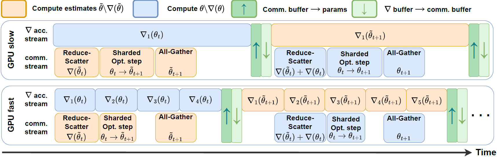

# ACCO: Accumulate While You Communicate



This repository implements **ACCO**, introduced in the paper:  
**"ACCO: Accumulate While You Communicate for Communication-Overlapped Sharded LLM Training"**

Authors:  
Adel Nabli¹², Louis Fournier¹, Pierre Erbacher¹, Louis Serrano¹, Eugene Belilovsky², Edouard Oyallon¹  
¹Sorbonne Université, CNRS, ISIR — Paris, France  
²Mila — Quebec AI Institute, Concordia University — Montréal, Québec  
📧 adel.nabli@sorbonne-universite.fr, edouard.oyallon@cnrs.fr

---

## 📄 Citation

If you use this work, please cite:

```bibtex
@misc{nabli2025accoaccumulatecommunicatecommunicationoverlapped,
      title={ACCO: Accumulate While You Communicate for Communication-Overlapped Sharded LLM Training}, 
      author={Adel Nabli and Louis Fournier and Pierre Erbacher and Louis Serrano and Eugene Belilovsky and Edouard Oyallon},
      year={2025},
      eprint={2406.02613},
      archivePrefix={arXiv},
      primaryClass={cs.LG},
      url={https://arxiv.org/abs/2406.02613}, 
}
```

📎 [View the paper on arXiv](https://arxiv.org/abs/2406.02613)

---

## 🚀 Overview

ACCO is a memory-efficient and communication-overlapping optimization algorithm for distributed LLM training. It decouples gradient synchronization and optimizer updates, reducing GPU idle time and supporting optimizer state sharding across heterogeneous clusters.

Compared to ZeRO:
- ✅ Reduces communication bottlenecks  
- ✅ Supports sharded optimizers  
- ✅ Scales across heterogeneous hardware  
- ✅ Matches or exceeds standard DDP performance

---

## 🧪 Training

Run training with ACCO or standard DDP:

```bash
# Launch ACCO training
python main.py train=acco

# Launch DDP training
python main.py train=ddp
```

---

## 📁 Dataset Download Example

```python
import os
from datasets import load_dataset

os.environ['HF_HOME'] = 'mypath/.cache/huggingface'
dataset = load_dataset("Skylion007/openwebtext")
```

---

## 🧼 Finetuning Example

```bash
# Finetune using ACCO
srun python main.py train=acco-ft data=alpaca model=llama3

# Finetune using DDP
srun python main.py train=ddp-ft data=alpaca model=llama3
```

---

## ⚙️ Asynchronous Training with `DecoupledTrainer`

```python
from transformers import AutoTokenizer, LlamaConfig, LlamaForCausalLM
from datasets import load_dataset
from decoupled_trainer import DecoupledTrainer

# Model setup
model_config = LlamaConfig(**model_cfg)
model = LlamaForCausalLM(model_config)
tokenizer = AutoTokenizer.from_pretrained("my_tokenizer")
dataset = load_dataset("my_dataset")

# Replace HF Trainer with DecoupledTrainer
trainer = DecoupledTrainer(
    model=model,
    tokenizer=tokenizer,
    train_dataset=dataset["train"],
    eval_dataset=dataset["validation"],
    text_column_name="text",
    args=train_config
)

trainer.train()
```
